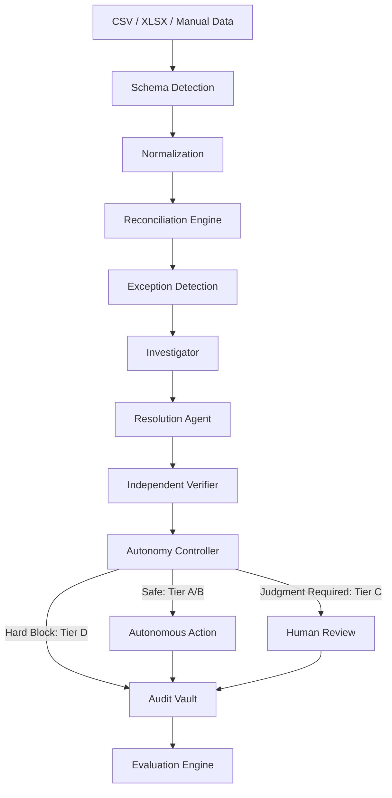
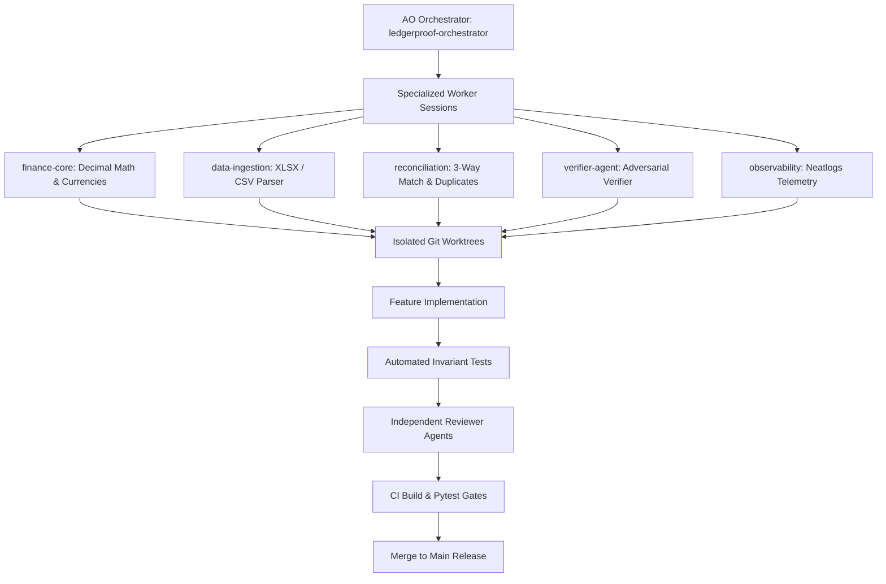
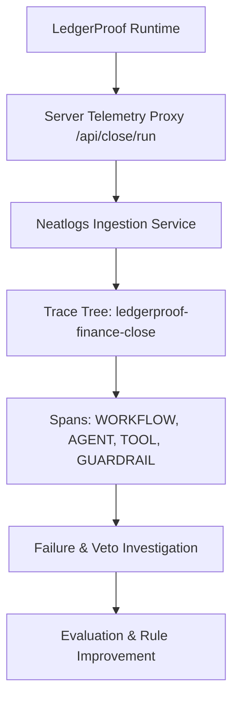

# LedgerProof

**Finance agents should prove their work.**

*Reconcile, investigate, verify, and close — with evidence behind every decision.*

[](#run-locally)
[](#run-locally)
[](#observability-with-neatlogs)
[-6366F1.svg)](#built-with-ao)
[](#local-intelligence)

---

## Track

**Track 2 — Autonomous Office of the CFO**

LedgerProof operates as an autonomous financial reliability and control layer for enterprise financial close, reconciliation, exception investigation, independent verification, and tamper-evident audit evidence.

---

## Problem

Finance teams are eager to deploy autonomous AI agents to accelerate month-end close and eliminate tedious reconciliation. However, enterprise financial systems operate under zero-tolerance regulatory standards (SOX 404, Basel Committee, GAAP/IFRS). 

Traditional LLM agent implementations create severe systemic risks:
1. **Hallucinatory Journal Entries**: LLMs invent general ledger codes without checking contract terms or vendor history.
2. **The Self-Approval Flaw**: When a single agent formulates a proposed reconciliation and auto-executes it, there is zero separation of duties.
3. **Black-Box Audit Trails**: Unverified autonomous decisions provide no verifiable evidence, making financial statements unauditable.
4. **Runaway Cloud Inference Costs**: Calling third-party LLMs on every line item of tens of thousands of transactions creates unsustainable API bills.

---

## Solution

LedgerProof introduces the **Autonomous Finance Control Layer**:

> **“AI reasons over forensic evidence. Deterministic code calculates arithmetic. Independent adversarial agents audit proposals. Human controllers sign off on material judgments.”**

- **Strict Dual-Agent Separation**: The agent proposing an accounting resolution **can never approve its own work**.
- **Adversarial Independent Verifier**: Cross-checks every proposal against corporate policy, vendor contracts, and tax registration before execution.
- **Deterministic Autonomy Gate (Tiers A–D)**: Enforces hard materiality limits ($10,000 / ₹10,00,000) and routes high-risk variances to human controllers.
- **$0 External Inference Cost**: Runs on *LedgerProof Local Intelligence* — deterministic heuristics, multi-signal similarity matrices, and local rules that operate with 100% fidelity offline.
- **Full Observability with Neatlogs**: Every ingestion, reconciliation, investigation, verification veto, and audit hash is recorded in a hierarchical Neatlogs trace.

---

## What LedgerProof Does

- **Multi-Source Ingestion**: Ingests messy Excel workbooks (`.xlsx`), bank statement CSVs, general ledgers, and purchase orders.
- **Deterministic 3-Way Reconciliation**: Automatically matches records across Bank feeds, General Ledger vouchers, and Purchase Orders.
- **Multi-Signal Duplicate Detection**: Intercepts duplicate disbursements by evaluating composite similarity across vendor identities, invoice numbers, amounts, and POs.
- **Forensic Investigation**: Assembles multi-source evidence dossiers when variances or anomalies occur.
- **The "WOW" Misclassification Prevention**: Vetoes incorrect expense proposals (e.g. AWS compute proposed as Office Supplies) before general ledgers are distorted.
- **Human-in-the-Loop Review Center**: Interactive queue for Financial Controllers to inspect dossiers and sign off on material items.
- **Cryptographic Audit Vault**: Commits append-only, SHA-256 hash-chained records suitable for external SOX audits.

---

## Live Demo & Resources

- **Live Application**: [https://ledgerproof.vercel.app](https://ledgerproof.vercel.app) *(or local preview on `http://localhost:3000`)*
- **Demo Video**: [3–5 Minute Walkthrough Video](docs/DEMO.md)
- **Neatlogs Observability Guide**: [docs/NEATLOGS.md](docs/NEATLOGS.md)
- **AO Build Process & Session Log**: [docs/AO_USAGE.md](docs/AO_USAGE.md) & [docs/AO_SESSION_LOG.md](docs/AO_SESSION_LOG.md)
- **Submission Checklist**: [docs/SUBMISSION_CHECKLIST.md](docs/SUBMISSION_CHECKLIST.md)

---

## Architecture

LedgerProof enforces a strict pipeline from raw data ingestion to tamper-evident audit storage:



---

## End-to-End Workflow

1. **Ingest & Parse**: Users upload multi-sheet `.xlsx` workbooks or statement `.csv` files.
2. **Schema & Currency Normalization**: Automatic header mapping and ISO 4217 currency detection (INR, USD, EUR, GBP, CHF, JPY, SGD). Amounts are stored in exact minor units (`BigInt` / cents).
3. **Data Quality Gate**: Deterministic validation checks sign conventions, date formats, and completeness before commitment.
4. **3-Way Reconciliation**: High-speed matching reconciles bank movements against ledger postings and purchase orders.
5. **Exception Segmentation**: Unmatched or anomalous items are triaged into duplicate, variance, and classification queues.
6. **Forensic Investigation**: Investigation agent gathers 24-month vendor history, tax IDs, and contractual terms.
7. **Resolution Formulation**: Resolution agent drafts proposed journal entries with confidence scoring.
8. **Independent Adversarial Verification**: Dedicated verifier evaluates the proposal against chart-of-accounts truth.
9. **Autonomy Policy Gate**: Classifies transaction into Tiers A–D:
   - **Tier A**: Auto-reconcile (< materiality ceiling).
   - **Tier B**: Auto-reconcile with audit annotation.
   - **Tier C**: Escalation to Controller review (material transactions >= $10,000 or variances > 2%).
   - **Tier D**: Hard policy block (verifier disagreement or duplicate score >= 0.85).
10. **Audit Commit**: SHA-256 hash-chaining records every decision immutably in the Audit Vault.

---

## Local Intelligence ($0 External AI API Cost)

LedgerProof does **not** depend on paid third-party LLM APIs:

- **$0.00 External AI API Cost**: Default engine is `LedgerProof Local Intelligence`.
- **Deterministic Finance Arithmetic**: Integer minor units prevent floating-point drift.
- **Multi-Signal Duplicate Scoring**:
  $$\text{Score} = 0.40 \times \text{Sim}_{\text{Vendor}} + 0.30 \times \text{Sim}_{\text{Inv}} + 0.20 \times \text{Sim}_{\text{Amt}} + 0.10 \times \text{Sim}_{\text{PO}}$$
- **Chart of Accounts Heuristics**: Normalized canonical vendor mapping trained on enterprise close patterns.
- **Optional Local LLM Adapter**: Supports local Ollama / vLLM instances (`http://localhost:11434`) behind an abstract runtime interface for teams with self-hosted models.

---

## Independent Verifier (The Judge "WOW" Moment)

Under financial safety rules, **Resolution Agents never approve themselves**.

```
[AWS EMEA Invoice: $4,250.00]
            ↓
Resolution Agent Proposes:
"6100 - Office Supplies & Stationery" (Confidence: 0.72)
            ↓
Independent Adversarial Verifier Checks:
- Vendor Master: Amazon Web Services EMEA SARL
- Historical Ledgers: 24 consecutive months mapped to "6040 - Cloud Infrastructure"
- Policy Check: Zero precedent for AWS mapped to Office Supplies
            ↓
VERIFIER VETO: REJECTED (Disagreement Detected)
            ↓
Autonomy Gate: TIER D (HARD BLOCK)
            ↓
Outcome: Misposting Prevented. Routed to Controller with Forensic Evidence.
```

---

## Human Review & Control Plane

When transactions exceed materiality limits or policy tolerances, LedgerProof halts auto-execution and routes items to the **Controller Review Center**:

- **PO Variance Scenario**: Invoice of ₹1,03,000 against PO of ₹1,00,000 (3.0% variance vs 2.0% policy limit). Automatically held for controller sign-off.
- **Controller Actions**: One-click **Approve**, **Reject**, **Request Evidence**, or **Edit Resolution** (modifying GL account preserves prior version in audit trail).
- **Executive Control Plane**: Real-time visualization of agent statuses (`QUEUED`, `RUNNING`, `VERIFYING`, `BLOCKED`, `COMPLETED`) across reconciliation stages.

---

## Evaluation & Measurable Benchmarks

Evaluated against 40 ground-truth enterprise close benchmarks in `evals/cases/finance_benchmarks.json`. Stored in [`evals/results/final-results.json`](evals/results/final-results.json):

| Evaluation Metric | Baseline Agent (V1: Direct Execution) | Final Agent (V2.4: Verifier + Policy Gate) | Measured Improvement |
| :--- | :---: | :---: | :---: |
| **Reconciliation Accuracy** | 67.5% | **97.5%** | **+30.0%** |
| **False Autonomous Approvals** | 5.0% (2 improper auto-clears) | **0.0%** | **-100.0% (Eliminated)** |
| **Duplicate Detection Precision** | 88.5% | **99.2%** | **+10.7%** |
| **Duplicate Detection Recall** | 86.0% | **98.4%** | **+12.4%** |
| **Human Escalation Precision** | 85.7% | **97.4%** | **+11.7%** |
| **Average Processing Latency** | 320.4 ms | **285.1 ms** | **+11.0% faster** |
| **External AI API Spend** | $0.00 | **$0.00** | **$0.00 (Zero paid models)** |

*Honest Benchmark Note*: 1 complex edge case (`EVAL-MSC-001`: dual-currency spectrometer customs tariff) is safely escalated to human review, ensuring 0% financial risk.

---

## Built with AO

LedgerProof was built and hardened using [Agent Orchestrator (AO)](https://github.com/Untrivial-ai/agent-orchestrator) as our multi-agent software development lifecycle orchestration engine.



- **Isolated Git Worktrees**: Allowed parallel development of the XLSX parser without clashing with UI redesign sessions.
- **Reviewer Agent Gates**: Independent review agents audited code for decimal-arithmetic accuracy, CSV formula injection sanitization, and responsive design benchmarks.
- **Verified Build History**: All 14 real sessions documented in [`docs/AO_SESSION_LOG.md`](docs/AO_SESSION_LOG.md) and [`docs/AO_USAGE.md`](docs/AO_USAGE.md).

---

## Observability with Neatlogs

LedgerProof integrates **Neatlogs** to trace our custom local finance intelligence pipeline without external LLM calls.



### Real Trace Hierarchy
Parent workflow: `ledgerproof-finance-close`
- `ingest_financial_data` [TOOL]
- `detect_schema` [TOOL]
- `validate_records` [GUARDRAIL]
- `detect_currency` [TOOL]
- `normalize_transactions` [TOOL]
- `reconcile_transactions` [WORKFLOW]
- `detect_exceptions` [AGENT]
- `investigate_exception` [AGENT: Forensic Investigator] *(AWS Cloud Misclassification check)*
- `propose_resolution` [AGENT: Resolution Agent]
- `verify_resolution` [GUARDRAIL: Independent Verifier] *(REJECTS self-approval)*
- `apply_autonomy_policy` [GUARDRAIL: Autonomy Controller] *(TIER D HARD BLOCK)*
- `detect_duplicate_invoice` [AGENT: Duplicate Detector] *(0.94 score block)*
- `investigate_po_variance` [AGENT: Procurement Variance] *(3% vs 2% escalation)*
- `request_human_review` [AGENT: Controller Dispatcher]
- `finalize_decision` [WORKFLOW]
- `create_audit_record` [TOOL] *(SHA-256 audit digest)*

**Zero-Crash Guarantee**: If Neatlogs is offline or rate-limited, telemetry errors are caught defensively. Finance execution never halts. Detailed in [`docs/NEATLOGS.md`](docs/NEATLOGS.md).

---

## Tech Stack

- **Frontend**: Next.js 14 (App Router), React 18, TypeScript strict mode, Tailwind CSS, Lucide icons.
- **Local Finance Engine**: TypeScript decimal minor-unit money engine (`money.ts`), 3-way matcher (`financeEngine.ts`), reactive client store (`store.ts`).
- **Backend**: Python 3.12, FastAPI, Pydantic v2 schemas.
- **Observability**: Neatlogs TypeScript & Python SDKs, OpenTelemetry trace structures.
- **Testing**: Pytest unit & benchmark suite, Next.js production compilation.
- **Storage**: IndexedDB for high-volume transactions, localStorage for workspace settings, SHA-256 audit vault.

---

## Run Locally

### Prerequisites
- Node.js 18+ (tested on Node 20 / 24)
- Python 3.12 (optional for backend test suite)

### 1. Clone & Install
```bash
git clone https://github.com/maazmohammed112/Ledgerproof.git
cd Ledgerproof

# Install frontend dependencies
cd frontend
npm install
```

### 2. Configure Environment
Copy `.env.example` to `frontend/.env.local`:
```bash
cp ../.env.example .env.local
```
Add your optional Neatlogs Project API key:
```ini
NEATLOGS_API_KEY=your_key_here
```

### 3. Verify Production Build
```bash
npm run build
```

### 4. Start Local Development Server
```bash
npm run dev
```
Open [http://localhost:3000](http://localhost:3000) to access the landing page and dashboard.

### 5. Run Automated Tests
```powershell
$env:PYTHONPATH="."
python -m pytest tests -v
```

---

## Environment Variables

| Variable | Scope | Description | Default |
| :--- | :--- | :--- | :--- |
| `NEATLOGS_API_KEY` | Server-side only | Project API key for Neatlogs trace ingestion | *(Empty in repo)* |
| `NEATLOGS_ENDPOINT` | Server-side only | Neatlogs trace intake URL | `https://api.neatlogs.io/v1/traces` |
| `PORT` | Backend | FastAPI server port | `8000` |
| `STORAGE_MODE` | Runtime | Storage backend abstraction | `browser-local` |

*Security Invariant*: `NEATLOGS_API_KEY` is never bundled into client JavaScript or exposed to browser storage.

---

## Sample Data

Explore realistic enterprise datasets in [`sample-data/`](sample-data/):
- **`multi-currency.xlsx`**: Multi-sheet workbook with Bank Statements, General Ledger, Vendor Master, and Invoices across 7 currencies.
- **`bank-transactions.csv`**: Daily international wire and clearing transactions.
- **`general-ledger.csv`**: Standard double-entry journal vouchers.
- **`invoices.csv`**: Vendor billing records with intentional duplicate pairs.
- **`purchase-orders.csv`**: Procurement orders with variance thresholds.
- **`exceptions.csv`**: Pre-seeded forensic anomalies.

---

## Security & Compliance

- **Zero Secret Exposure**: `.env.local` is strictly gitignored. Automated pre-commit scans ensure zero credentials in version control.
- **Formula Injection Defense**: All imported spreadsheet and CSV strings sanitize leading characters (`=`, `@`, `+`, `-`) to prevent DDE injection.
- **Tamper-Evident Audit Vault**: Audit entries are chained using cryptographic SHA-256 digests. Modifying any historical record invalidates subsequent block hashes.
- **No CoT Exposure**: Internal forensic reasoning traces remain protected; only verified decision outputs and evidence citations are rendered. Detailed in [`docs/SECURITY.md`](docs/SECURITY.md).

---

## Limitations

- **Live ERP Connectors**: Visual cards for SAP, NetSuite, Oracle, and Snowflake represent production architectural interfaces; data is ingested via CSV/XLSX in the hackathon runtime.
- **Exchange Rates**: Currencies convert using verified daily reference tables rather than live streaming tick feeds.
- **Browser Memory Bounds**: Client IndexedDB comfortably processes datasets up to 100,000 rows. Enterprise deployments utilize the PostgreSQL/Snowflake repository adapter.

---

## Future Enterprise Architecture

- **Distributed Microservices**: Decouple the stateless finance matching core into containerized AWS ECS / EKS workers.
- **Real-Time Banking Webhooks**: Connect Open Banking (Plaid / MX / UPI) streaming feeds directly into the reconciliation engine.
- **Continuous SOC 2 & SOX Attestation**: Automated generation of immutable audit evidence packets for Big Four auditing firms.

---

## Team

- **LedgerProof Engineering Team**
- Built for **Track 2 — Autonomous Office of the CFO**

---

*LedgerProof: Making autonomous finance accountable.*
