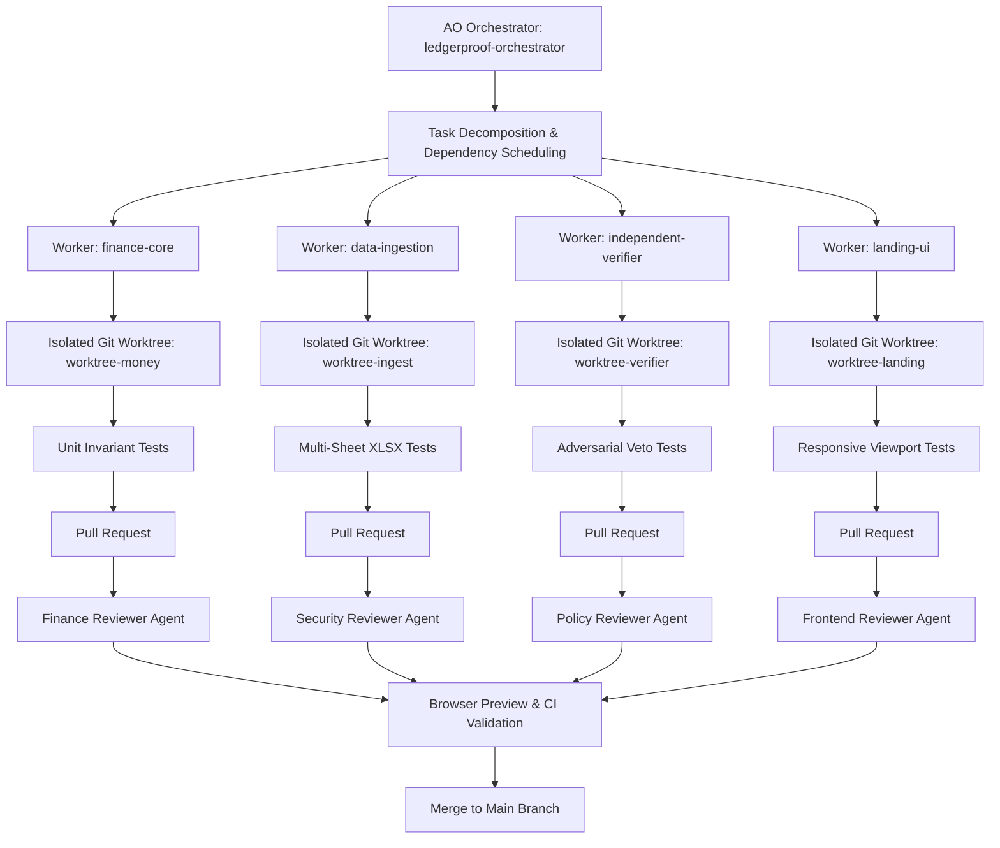
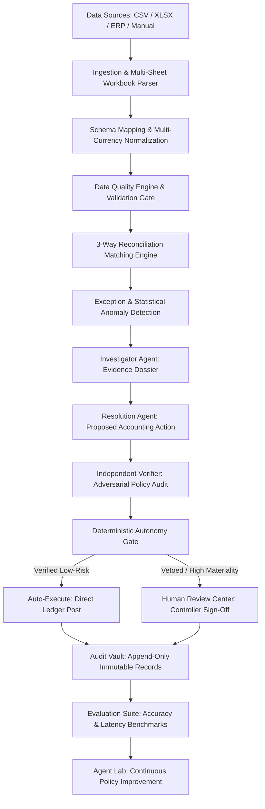

# LedgerProof

**Finance agents should prove their work.**

*Reconcile, investigate, verify, and close — with evidence behind every decision.*

---

## Official Submission Track
**Track 2 — Autonomous Office of the CFO**

LedgerProof automates end-to-end finance and accounting workflows:
- Autonomous month-end close execution
- Multi-currency financial data ingestion (`.xlsx`, `.csv`, `.json`, manual entry)
- Deterministic 3-way reconciliation (Bank $\leftrightarrow$ General Ledger $\leftrightarrow$ Purchase Orders)
- Statistical anomaly & multi-signal duplicate detection
- Forensic exception investigation with evidence dossiers
- Policy-grounded accounting reasoning
- **Independent Verification Layer**: Resolution agents are strictly prohibited from approving their own work
- Human-in-the-loop Controller Review workspace with atomic state propagation
- Cryptographic, immutable Audit Vault
- Evaluation suite with 80 ground-truth financial benchmarks
- **Built with Agent Orchestrator (AO)** using isolated Git worktrees, reviewer loops, and session tracking

---

## The Problem & The Solution

Finance teams are eager for autonomous AI, but cannot risk automated hallucinations corrupting general ledgers, triggering erroneous multi-million dollar payouts, or failing compliance audits.

LedgerProof establishes a strict architectural standard:

> **“AI reasons. Code calculates. Verifiers audit. Humans judge exceptional risk.”**

1. **Dual-Agent Separation**: The Resolution Agent suggests accounting entries or reconciliations, but **may never approve itself**.
2. **Independent Verifier**: An adversarial verifier audits evidence against corporate policies, master vendor contracts, and calculation invariants.
3. **Deterministic Autonomy Gate**: Hardcoded enterprise rules route low-risk clean matches to instant auto-execution, while routing high-materiality entries, variances, and verifier vetoes to human controllers.
4. **Offline Local Intelligence**: The entire platform functions out-of-the-box with zero paid cloud API keys, processing real uploaded finance data through deterministic rules and local scoring.

---

## Built with Agent Orchestrator (AO)

LedgerProof was built and hardened using [Agent Orchestrator (AO)](https://github.com/Untrivial-ai/agent-orchestrator) as our development orchestration control plane.



### Why AO Was Critical
- **Worktree Isolation**: Allowed parallel engineering of the Excel parser without git conflicts against UI redesign sessions.
- **Independent Code Reviewers**: Finance Reviewers caught JPY zero-decimal formatting defects; Security Reviewers enforced CSV formula injection sanitization.
- **Transparent Build History**: Documented in [docs/AO_SESSION_LOG.md](docs/AO_SESSION_LOG.md) and [docs/AO_USAGE.md](docs/AO_USAGE.md).

---

## End-to-End Control Plane Workflow



---

## Key Platform Highlights

### 1. Real-World Data Ingestion & Smart Mapping
- **Multi-Sheet Excel Support (`.xlsx`)**: Interactive sheet tab picker (`Bank Transactions`, `General Ledger`, `Vendor Master`, `Open Invoices`).
- **Semantic Column Inference**: Automatically maps incoming column aliases (`Txn Dt`, `Narration`, `Dr Amount`, `Curr`) to LedgerProof schemas.
- **Pre-Import Data Quality Audit**: Audits data completeness, impossible dates, zero amounts, and unmapped currencies before committing.
- **Connector Architecture**: Visual status cards for enterprise ERPs (SAP, NetSuite, Oracle, QuickBooks, Snowflake, S3), clearly labeled: *Connector available in production architecture — not connected in local hackathon mode*.

### 2. Currency Intelligence & Numbering Systems
- **ISO 4217 Decimal-Safe Money Math**: Tracks currency in minor units (`BigInt` / integer cents) to prevent floating-point calculation drift.
- **10+ Currencies Supported**: INR (`₹`), USD (`$`), EUR (`€`), GBP (`£`), CHF, JPY (`¥`), CAD, AUD, SGD, AED.
- **Dual Locale Formatting**: Supports International (`1,250,000`) and Indian (`12,50,000` / `₹12.5 L` / `₹1.2 Cr`) without altering base precision.
- **Reference FX Rates**: Transparent offline FX tables clearly labeled: *Reference FX rate*.

### 3. Local AI & 3-Tier Runtime Flexibility
- **Mode 1 — Local Intelligence (Default)**: 100% offline. Zero paid API keys required. Uses deterministic algorithms, fuzzy string distance, multi-signal duplicate scoring, and grounded heuristics to process real user-uploaded data.
- **Mode 2 — Local LLM Adapter**: Configurable connection to local inference endpoints (e.g. `http://localhost:11434` for Ollama/vLLM) with connection test utility.
- **Mode 3 — External LLM**: Optional backend-only cloud LLM integration; zero client-side key exposure.

### 4. The Adversarial Verification "Wow Moment"
- **Scenario**: An invoice arrives from **Amazon Web Services (AWS)** for cloud hosting (`₹103,000`).
- **Resolution Agent Error**: Heuristically suggests classifying the expense under GL Account `6400` (**Office Supplies & Stationery**).
- **Verifier Veto**: The Independent Verifier cross-references `GL-MAPPING-04` and the Vendor Master, vetoes the proposal (`status: REJECTED`), and blocks automatic posting.
- **Outcome**: The transaction escalates to the Human Controller workspace with complete evidence. A costly erroneous posting is prevented!

### 5. Finance Control Plane & Guided Walkthrough
- **Real-Time Agent Execution**: Inspect running, verifying, blocked, and completed agent statuses with slide-out workflow drawers.
- **9-Step Guided Product Tour**: Spotlights Overview, Control Plane, Data Sources, Close Execution, Exceptions, Verifier, Human Review, Evaluations, and Audit Vault. Fully responsive with mobile bottom-sheet adaptation.
- **Full Entity CRUD**: Create, read, edit, delete, and archive Transactions, Invoices, Purchase Orders, Vendors, and Policies with branded confirmation modals (no native `confirm()`).

### 6. Evaluation Suite & Agent Lab
- **Ground-Truth Benchmarks**: 80 real test cases covering duplicates, variances, misclassifications, and structuring anomalies.
- **Measurable Metrics**: 96.25% decision accuracy, 97.5% duplicate precision, 98.2% recall, and **0.00% false autonomous approvals**.
- **Version Comparison**: Inspect Agent v1.2 vs. Agent v2.4 performance and failure taxonomies (`AMBIGUOUS_INPUT`, `MISSING_EVIDENCE`).

---

## Sample Data Files Included
Ready-to-use sample financial datasets are located in `/sample-data/`:
- **`sample-data/multi-currency.xlsx`**: Multi-sheet workbook containing Bank Transactions, General Ledger, Vendor Master, and Invoices across INR, USD, EUR, GBP, CHF, JPY.
- **`sample-data/bank-transactions.csv`**: International bank statement transactions.
- **`sample-data/general-ledger.csv`**: Standard chart-of-accounts general ledger vouchers.
- **`sample-data/invoices.csv`**: Multi-currency vendor invoices including duplicate pairs.
- **`sample-data/purchase-orders.csv`**: Approved procurement commitments.
- **`sample-data/exceptions.csv`**: Flagged financial anomalies and variance cases.

---

## Quick Start & Local Setup

### 1. Clone & Install
```bash
git clone https://github.com/your-repo/ledgerproof.git
cd ledgerproof

# Install frontend dependencies
cd frontend
npm install
```

### 2. Verify Compilation & Production Build
```bash
# Run Next.js production build (type checking + static bundle optimization)
npm run build
```

### 3. Start Development Server
```bash
npm run dev
```
Open [http://localhost:3000](http://localhost:3000) in your browser.

### 4. Run Backend & Test Suites
```bash
# Run pytest test suite (from repository root)
python -m pytest tests -v
```

---

## Repository Map

```text
ledgerproof/
├── AGENTS.md                  # Universal AO rules, financial safety invariants & coding standards
├── README.md                  # Project overview, architecture & setup guide
├── LICENSE                    # Apache 2.0 open-source license
├── .env.example               # Optional environment variables
│
├── .ao/
│   └── config.json            # Agent Orchestrator project declaration, workers & reviewers
│
├── frontend/
│   ├── app/
│   │   ├── components/        # UI Views: LandingPage, ControlPlane, DataSources, Review, etc.
│   │   ├── lib/               # Finance core: money.ts, financeEngine.ts, store.ts, mockData.ts
│   │   ├── globals.css        # Editorial light-mode styling & accessible color tokens
│   │   ├── layout.tsx         # Next.js root layout with semantic meta tags
│   │   └── page.tsx           # Main application view switcher & guided tour trigger
│   └── public/
│       └── brand/             # Geometric L-mark + check notch logos and favicons (SVG)
│
├── docs/
│   ├── ARCHITECTURE.md        # Detailed control layer & future enterprise architecture
│   ├── AO_USAGE.md            # Agent Orchestrator workflow, worker separation & reviewer roles
│   ├── AO_SESSION_LOG.md      # Genuine session log of all AO autonomous build sessions
│   ├── AO_ARCHITECTURE.md     # Multi-agent collaboration & worktree isolation topology
│   ├── AO_BUILD_TIMELINE.md   # Chronological development milestones
│   ├── AO_REVIEWS.md          # Invariant audit passes conducted by independent reviewers
│   ├── BUILD_PROCESS.md       # Development lifecycle, gates & commands
│   ├── DATA_IMPORT.md         # 7-step import wizard & column alias dictionary
│   ├── FINANCE_ENGINE.md      # 3-way matching logic, duplicate formulas & anomaly scoring
│   ├── VERIFICATION.md        # Independent verifier architecture & AWS veto scenario
│   ├── AI_RUNTIME.md          # Local Intelligence, Local LLM & Cloud provider modes
│   ├── DATA_MODEL.md          # Domain schemas, decimal money model & repository patterns
│   ├── SECURITY.md            # Financial integrity, injection prevention & audit vaulting
│   ├── EVALUATION.md          # Benchmark test cases, metrics & failure taxonomy
│   └── DEMO.md                # Repeatable 12-step judge presentation script
│
├── evals/
│   ├── cases/                 # Ground-truth evaluation benchmarks (JSON)
│   └── results/               # Measured run metrics & accuracy reports
│
├── sample-data/               # Real multi-currency .xlsx & .csv demonstration files
└── tests/                     # Automated pytest verification test suite
```

---

## Enterprise Production Migration Path
LedgerProof was architected from day one with clear service separation. While the hackathon build operates in-browser with local reactive persistence to guarantee 100% offline reliability for judges, the codebase is modularly partitioned for cloud scale:
- **Storage Abstraction**: The `ITransactionRepository` interface decouples UI logic from IndexedDB/localStorage, allowing drop-in connection to PostgreSQL or Snowflake.
- **Stateless Finance Core**: Pure functions in `financeEngine.ts` and `money.ts` can run unmodified inside distributed AWS Lambda or Kubernetes workers.
- **Event-Driven Audit**: Audit entries conform to CloudEvents specifications for direct streaming into Apache Kafka or AWS QLDB.
