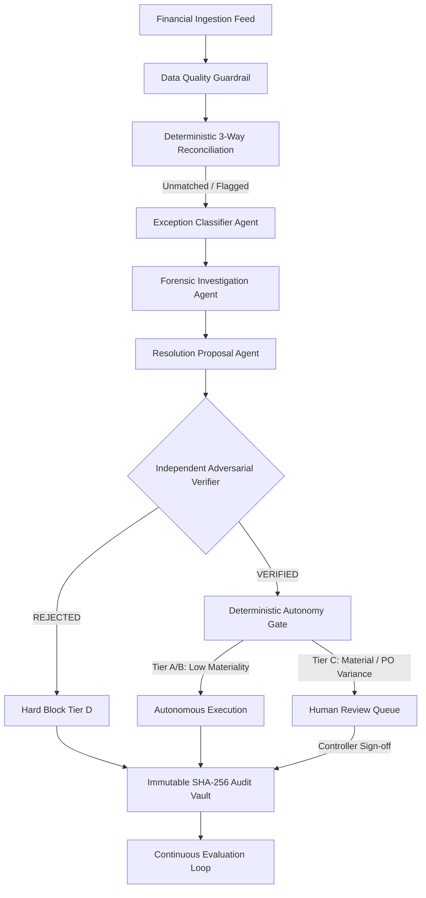

# LedgerProof Agent Architecture

> **Track 2**: Autonomous Office of the CFO  
> **Core Principle**: Finance reasoning agents propose solutions; deterministic code computes arithmetic; independent adversarial agents verify evidence; humans sign off on material judgments.

---

## 1. Multi-Agent Orchestration Flow

LedgerProof decouples financial reasoning into specialized autonomous agents governed by hard policy constraints:

---

## 2. Specialized Agent Roles & Boundaries

### 1. Forensic Investigation Agent
- **Role**: Discovers factual accounting evidence across multi-source historical ledgers.
- **Tools**: Vendor master lookup, historical 24-month chart of accounts retrieval, purchase order line matching.
- **Constraint**: Purely forensic. May never propose journal entries or approve postings.

### 2. Resolution Proposal Agent
- **Role**: Formulates candidate accounting actions (reclassify GL account, match to PO, accrue variance, or flag duplicate).
- **Output**: Proposal object containing debit/credit lines, confidence score, and forensic rationale.
- **Safety Invariant**: **NEVER ALLOWED TO SELF-APPROVE**. All proposals must route to the Independent Verifier.

### 3. Independent Adversarial Verifier
- **Role**: Cross-examines the Resolution Proposal against accounting ground truth, vendor contracts, and tax registration.
- **Design**: Operates with an adversarial bias — actively looks for policy violations, account mismatches, and duplicate signs.
- **The "Judge WOW" Invariant**:
  - If Resolution Agent proposes `6100 (Office Supplies)` for an `AWS Cloud` invoice, the Verifier vetoes the proposal based on 24-month vendor history (`6040 Cloud Infrastructure`).

### 4. Deterministic Autonomy Gate
- **Role**: Risk and policy classifier that routes transactions into SOX-compliant autonomy tiers.
- **Tiers**:
  - **Tier A (Autonomous Auto-Clear)**: Exact 3-way match, variance = 0%, score = 1.0, amount < materiality ceiling.
  - **Tier B (Autonomous with Audit Flag)**: Immaterial rounding variance (< 0.5%), known recurring vendor.
  - **Tier C (Mandatory Human Sign-Off)**: Amount >= $10,000 (or ₹10,00,000), PO variance > policy tolerance (2.0%), or missing documentation.
  - **Tier D (Hard Policy Block)**: Verifier rejection, suspected duplicate score >= 0.85, or sanction match. Auto-execution strictly blocked.

### 5. Controller Human Review Agent
- **Role**: Pre-assembles the decision dossier for human finance controllers.
- **Interface**: Supplies side-by-side transaction vs PO comparison, verifier rationale, and single-click Approve / Reject / Edit actions.

---

## 3. Local Intelligence Architecture ($0 External API Cost)

LedgerProof runs by default on **LedgerProof Local Intelligence**:
1. **Deterministic Financial Arithmetic**: Minor-unit integer arithmetic (cents/paise) prevents floating-point inaccuracies.
2. **Multi-Signal Similarity Scoring**: Weighted composite matrix evaluates vendor Levenshtein distance, normalized invoice token match, amount equivalence, and PO reference.
3. **Chart of Accounts Heuristics**: Normalized vendor-to-GL mapping trained on historical close periods.
4. **Zero Cloud LLM Dependency**: $0.00 external inference cost, 100% offline-first execution, and zero data leakage.
