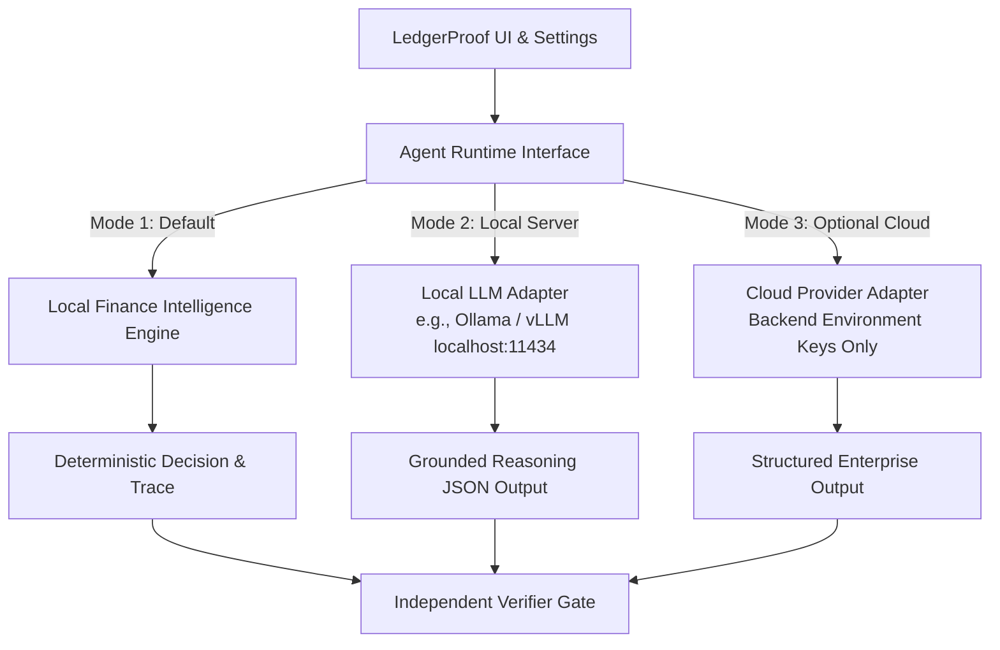

# AI Runtime Architecture & Inference Modes

LedgerProof decouples financial business logic from external model inference via a modular **Agent Runtime Interface**. The platform functions completely and deterministically out-of-the-box without requiring any external AI API keys.

---

## 1. Runtime Modes



### Mode 1 — Local Intelligence (Default, 100% Offline)
- Requires zero API keys or external network requests.
- Employs deterministic finance algorithms:
  - **Fuzzy Token Matching**: Levenshtein distance and token-sort metrics for vendor resolution.
  - **Multi-Signal Duplicate Scoring**: Weighted model checking exact invoice IDs, vendor similarity, amount equality, and date proximity.
  - **Contract Variance Calculation**: Percentage tolerance calculation against purchase orders.
  - **Heuristic GL Classifier**: Maps recurring vendor patterns and description keywords to standard chart of accounts.
- Outputs grounded, structured decision JSON format identical to LLM payloads.

### Mode 2 — Local LLM Adapter
- Connects to a local OpenAI-compatible endpoint such as Ollama or LocalAI:
  - **Endpoint**: Configurable (e.g. `http://localhost:11434/v1`)
  - **Model**: `llama3.2`, `mistral`, or `qwen2.5-coder`
  - **Timeout**: Configurable (default 15s)
- Features a **Test Connection** button inside `Settings -> AI Runtime`.
- Does not block or fail if the local server is offline; falls back gracefully to Mode 1.

### Mode 3 — External LLM (Enterprise Cloud)
- Optional connector for enterprise cloud inference.
- API keys are managed strictly on the backend server through environment variables (`LEDGERPROOF_AI_KEY`).
- Never exposed or passed to the browser bundle.

---

## 2. Structured Agent Decision Schema
Regardless of which runtime mode generates a suggestion, output is constrained by a strict TypeScript/JSON schema:

```json
{
  "decision": "ESCALATE",
  "confidence": 0.94,
  "risk": "MEDIUM",
  "reason_summary": "Invoice exceeds permitted PO variance under policy AP-VARIANCE-02.",
  "evidence": ["INV-483", "PO-998"],
  "policy": ["AP-VARIANCE-02"],
  "recommended_action": "Controller review required before release."
}
```

This prevents unconstrained free-form text from corrupting financial state machines.
