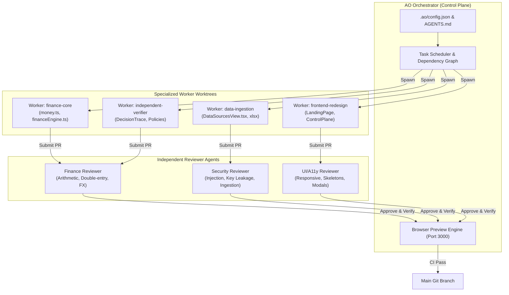

# AO Architecture & Multi-Agent Collaboration

This document outlines how the **Agent Orchestrator (AO)** environment was integrated into LedgerProof's software delivery process.

---

## 1. Orchestration Topology

---

## 2. Worktree Isolation Mechanism

In standard single-agent systems, file edits frequently step on each other or overwrite partial work. In AO:
- Each worker executes inside a dedicated Git worktree (`git worktree add ../worktree-name branch-name`).
- Edits are committed incrementally with semantic commit messages.
- Reviewer agents check the pull request diff against the workspace constraints defined in `AGENTS.md`.
- Once verified, the pull request merges into `main`, triggering the build pipeline.

---

## 3. Reviewer Protocols
Reviewer agents enforce strict financial and engineering standards:
1. **Double Verification Rule**: Code that generates financial resolutions cannot also approve them. The verifier component must remain independent.
2. **Formula Injection Neutralization**: Any CSV export must escape leading `=`, `@`, `+`, or `-` characters with a leading single quote `'`.
3. **Locale-Aware Numerals**: Numeric inputs and displays must support both Indian grouping (`12,50,000`) and International grouping (`1,250,000`) without corrupting base minor unit values.
