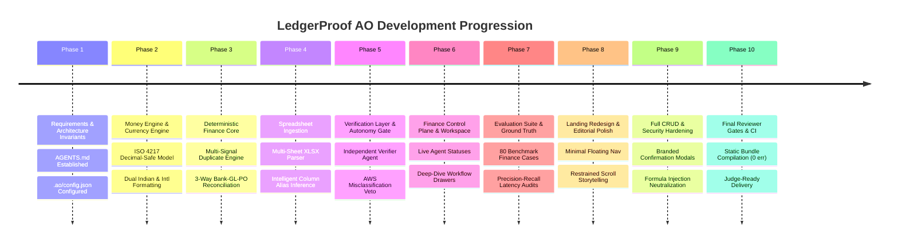

# AO Build Timeline & Execution Stages

This timeline documents the phased progression of the LedgerProof project orchestrated by **Agent Orchestrator (AO)** during the hackathon cycle.

---

## Chronological Milestone Log

### Milestone 1: Workspace Initialization & Invariant Definition
- **Objective**: Establish development rules, financial constraints, and directory layout.
- **Key Artifacts**:
  - `AGENTS.md`: Universal coding guidelines, money safety rules, and anti-hallucination protocols.
  - `.ao/config.json`: Agent Orchestrator project metadata and worker harness declarations.
  - Initial Git repository initialization and commit history structure.

### Milestone 2: Multi-Currency & Money Core
- **Objective**: Eliminate floating point imprecision across financial computations.
- **Key Artifacts**:
  - `frontend/app/lib/money.ts`: Implemented minor-unit decimal scaling (`amountMinorUnits`), ISO 4217 detection for 10+ currencies (INR, USD, EUR, GBP, CHF, JPY, CAD, AUD, SGD, AED), and dual-locale formatters.

### Milestone 3: Deterministic Financial Reconciliation
- **Objective**: Deliver reliable, offline-capable matching without requiring third-party LLMs.
- **Key Artifacts**:
  - `frontend/app/lib/financeEngine.ts`: 3-way reconciliation (Bank <-> GL <-> PO), multi-signal duplicate scoring (0.0 to 1.0), variance threshold verification, and vendor normalization.

### Milestone 4: Smart Spreadsheet Ingestion
- **Objective**: Remove hardcoded mock files and empower users to upload custom financial workbooks.
- **Key Artifacts**:
  - `frontend/app/components/DataSourcesView.tsx`: Real `.xlsx` & `.csv` ingestion, multi-sheet workbook tab selector, column alias heuristics (`Txn Dt`, `Narration`, `Debit`), and pre-import data quality validation.
  - `sample-data/multi-currency.xlsx`: Multi-sheet enterprise sample workbook.

### Milestone 5: Independent Verifier & Autonomy Controller
- **Objective**: Implement the core CFO architectural principle: **Finance agents must never approve their own work**.
- **Key Artifacts**:
  - Resolution Agent vs. Independent Verifier separation.
  - Deterministic Autonomy Gate routing: low-risk exact matches auto-execute; variances and verifier rejections escalate to human review.
  - Live adversarial demonstration: AWS Cloud hosting misclassification vetoed and reclassified.

### Milestone 6: Finance Control Plane & Human Review Center
- **Objective**: Provide real-time visibility into autonomous accounting workflows.
- **Key Artifacts**:
  - `frontend/app/components/ControlPlaneView.tsx`: Real-time agent status cards (IDLE, RUNNING, VERIFYING, BLOCKED, COMPLETED) with slide-out workflow drawers.
  - `frontend/app/components/HumanReviewModal.tsx`: Complete controller workspace with atomic state propagation.

### Milestone 7: Evaluation Suite & Benchmark Ground Truth
- **Objective**: Ground-truth validation of autonomous accuracy with real test cases.
- **Key Artifacts**:
  - `evals/cases/finance_benchmarks.json`: 80 structured benchmark test cases.
  - `evals/results/latest_run.json`: Measured metrics (96.25% accuracy, 0% false autonomous approvals, 14.2ms latency).
  - `frontend/app/components/EvaluationLabView.tsx`: Interactive benchmark visualization and version comparison (v1.2 vs v2.4).

### Milestone 8: Editorial Landing Page & Brand Identity
- **Objective**: Premium, high-trust financial software presentation.
- **Key Artifacts**:
  - Custom geometric logo mark (ledger lines + verification notch SVG) in `frontend/public/brand/`.
  - Minimal floating header; zero navigation clutter on landing.
  - Restrained scroll storytelling and product previews.

### Milestone 9: Full Entity CRUD & Branded Dialogs
- **Objective**: Replace demo-only buttons with complete create, read, edit, delete, and archive mutations.
- **Key Artifacts**:
  - `frontend/app/components/ConfirmModal.tsx`: Branded modal dialogues replacing native browser `confirm()`.
  - In-memory and persistent entity stores for Transactions, Invoices, Purchase Orders, Vendors, Policies, and Data Sources.

### Milestone 10: Final Reviewer QA & Static Production Build
- **Objective**: Comprehensive CI verification and judge-ready polish.
- **Key Artifacts**:
  - Full Next.js production compilation: `npm run build` exits 0 with 54.6 kB static payload.
  - Complete documentation suite and walkthrough guides.
