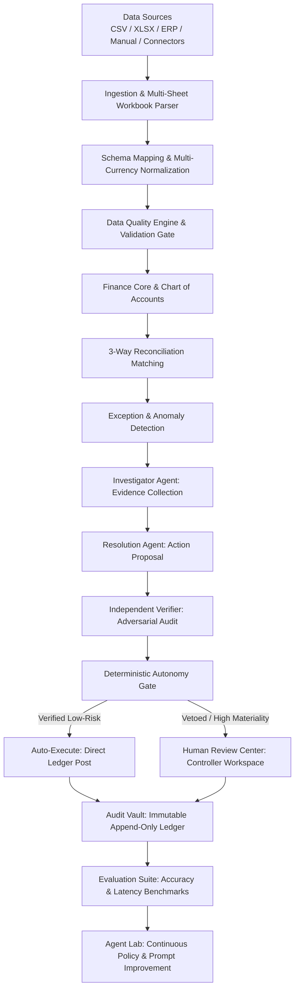
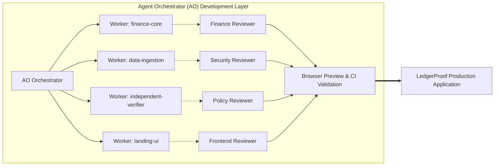
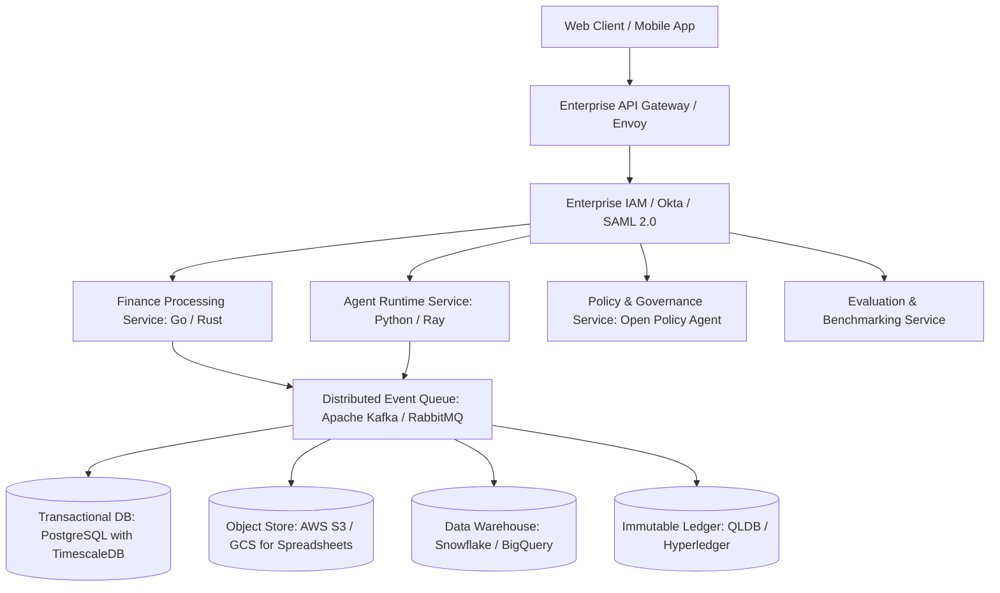

# LedgerProof — Enterprise Architecture Specification

## Product Vision
**LedgerProof** is the **Autonomous Finance Control Layer** designed for **Track 2 — Autonomous Office of the CFO**.

Tagline: **Finance agents should prove their work.**  
Mission: **Reconcile, investigate, verify, and close — with evidence behind every decision.**

---

## 1. End-to-End Financial Control Workflow

---

## 2. Agent Orchestrator (AO) as Development Control Plane

---

## 3. Implemented Hackathon Architecture vs. Future Enterprise Architecture

### Implemented Today (Hackathon Local-First Production Build)
- **Frontend Layer**: Next.js 14 App Router, React 18, TypeScript, Tailwind CSS, Lucide Icons, Lucide geometric brand marks.
- **Client Storage**: In-Memory Reactive Store with LocalStorage synchronization and Repository pattern abstractions.
- **Ingestion**: Client-side streaming `.xlsx` workbook parser (`xlsx`) and CSV parser with column alias heuristics.
- **Finance Engine**: Deterministic multi-signal duplicate detection, 3-way reconciliation (Bank <-> GL <-> PO), statistical anomaly detection, and decimal minor-unit money math.
- **AI Runtime**: Local Intelligence (Default, 100% offline, zero API keys required) with optional local OpenAI-compatible endpoint adapter (Ollama/vLLM).
- **Control & Audit**: Real-time Finance Control Plane with workflow detail drawers, dedicated Human Review workspace, and JSON-exportable Audit Vault.
- **Evaluation**: 80-case ground-truth benchmark suite with version comparison and failure taxonomy.

### Future Enterprise Production Architecture (Scalable to 10M+ Records)

*Note: For the hackathon submission, all core workflows execute deterministically in the local application bundle to guarantee 100% judge reliability without depending on third-party cloud infrastructure.*
