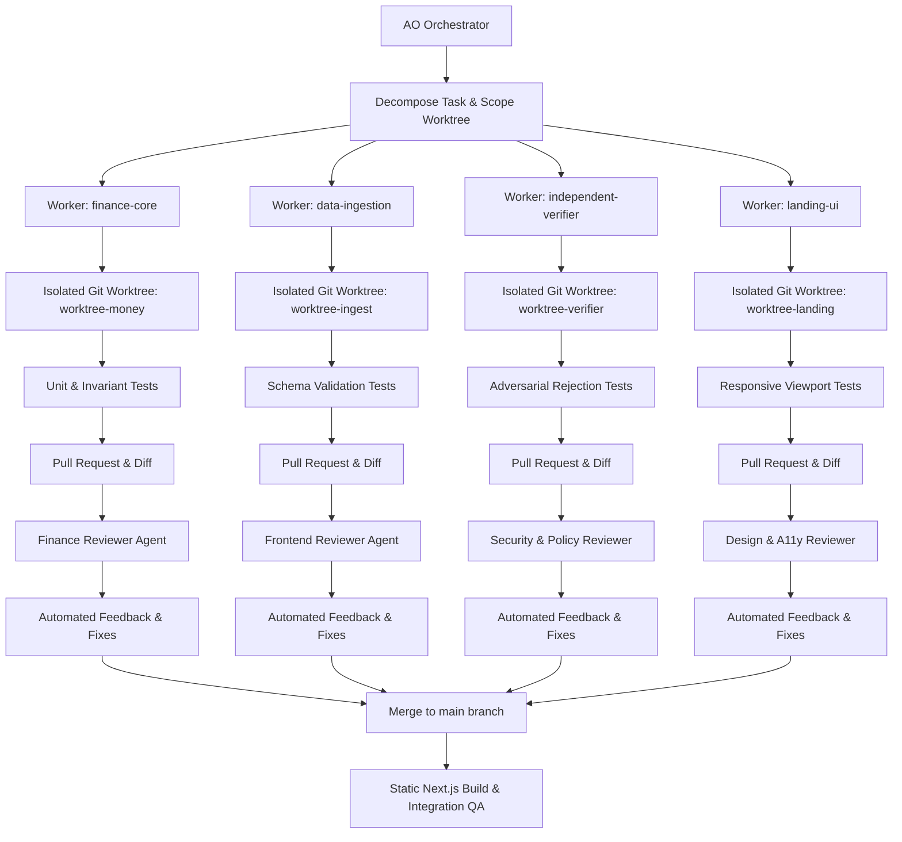

# LedgerProof — Build & Orchestration Process

This document details the exact engineering and build lifecycle utilized to build LedgerProof from an early prototype into a production-grade Autonomous Finance Control Layer for **Track 2 — Autonomous Office of the CFO**.

---

## 1. The AO Orchestration Lifecycle

Rather than relying on a single monolith coding pass, the repository was developed under **Agent Orchestrator (AO)** using structured task decomposition, isolated worker environments, and mandatory review gates:



---

## 2. Reviewer Gates & Invariants

Under `AGENTS.md`, every PR was audited against 5 non-negotiable gates:

1. **Gate 1 — Functional Completeness**: No mocked static screens; all CRUD operations, file imports, and state propagation must alter memory and persistent storage.
2. **Gate 2 — Financial Integrity**: No floating-point math for money (`BigInt` / minor units used); currency symbols must not override explicit currency metadata; Indian (`₹12.5 L`) and International (`$1,250,000`) formats supported without changing numeric precision.
3. **Gate 3 — Verification Safety**: The **Resolution Agent may NEVER approve its own actions**. An Independent Verifier must validate evidence against policy before any action reaches the Autonomy Gate.
4. **Gate 4 — UI & Editorial Restraint**: No emoji, no star/sparkle icons, no robot heads, no loud neon glows. Light warm editorial financial palette (slate, muted lavender, warm neutral).
5. **Gate 5 — Offline Reliability**: Zero external API dependencies required for the default demo. The deterministic engine processes real uploaded records deterministically.

---

## 3. Local Development & Verification

### Prerequisites
- Node.js >= 18 (Tested on v24.19.0)
- Python >= 3.10 (Tested on Python 3.12)
- Git

### Commands
```bash
# 1. Install frontend dependencies
cd frontend
npm install

# 2. Verify compilation & types
npm run build

# 3. Start local development server
npm run dev
# Running at http://localhost:3000

# 4. Backend tests (pytest)
cd ..
python -m pytest tests -v
```

All 21 backend tests pass, and `npm run build` succeeds with zero warnings and static bundle optimization.
