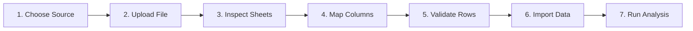

# Data Ingestion & Smart Schema Mapping

LedgerProof provides a 7-step enterprise financial ingestion wizard supporting multi-sheet Excel spreadsheets (`.xlsx`), CSV files, and structured JSON payloads.

---

## 1. 7-Step Import Experience

1. **Step 1: Choose Source**: Select from Bank Transactions, General Ledger Postings, Vendor Invoices, Purchase Orders, or Vendor Master.
2. **Step 2: Upload File**: Drag and drop `.xlsx`, `.csv`, or `.json` files.
3. **Step 3: Inspect Workbook**: If an Excel workbook contains multiple sheets (e.g. `Bank Transactions`, `General Ledger`, `Vendor Master`), an interactive sheet selector allows the user to pick the target worksheet.
4. **Step 4: Smart Column Mapping**: Automatically infers standard LedgerProof fields from arbitrary ERP or banking column headers with confidence indicators.
5. **Step 5: Pre-Import Validation**: Audits every row for data quality defects (e.g., missing amounts, malformed dates, negative debits) and displays an inspection table before committing records.
6. **Step 6: Import & Commit**: Ingests valid rows into the state store and creates an append-only audit event in the Audit Vault.
7. **Step 7: Analyze**: Automatically routes imported records into the deterministic reconciliation and exception engines.

---

## 2. Intelligent Column Alias Matching Dictionary

Users should not have to manually rename columns from NetSuite, SAP, Oracle, QuickBooks, or bank exports. LedgerProof incorporates a semantic matching dictionary:

| Target LedgerProof Field | Recognized Header Aliases |
| :--- | :--- |
| **`date`** | `Txn Dt`, `Txn Date`, `Transaction Date`, `Posting Date`, `Value Date`, `Booking Date`, `Date`, `Dt` |
| **`description`** | `Narration`, `Description`, `Memo`, `Transaction Particulars`, `Details`, `Line Item`, `Remark` |
| **`debit`** | `Debit`, `Dr`, `Dr Amount`, `Withdrawal`, `Payment`, `Debit (USD)`, `Dr.` |
| **`credit`** | `Credit`, `Cr`, `Cr Amount`, `Deposit`, `Receipt`, `Credit (USD)`, `Cr.` |
| **`currency`** | `Curr`, `Currency`, `ISO`, `Ccy`, `Currency Code` |
| **`reference`** | `Reference`, `Ref`, `Ref No`, `Transaction ID`, `Voucher ID`, `Txn Ref`, `Chq No`, `Cheque` |
| **`vendor`** | `Supplier`, `Vendor`, `Party Name`, `Beneficiary`, `Payee`, `Creditor`, `Vendor Name` |
| **`invoice_no`** | `Invoice#`, `Invoice No`, `Bill No`, `Invoice Number`, `Document No` |
| **`po_number`** | `PO#`, `PO Number`, `Purchase Ref`, `Order No`, `Purchase Order` |
| **`gl_account`** | `GL`, `Account`, `Account Code`, `Nominal Code`, `Cost Center`, `GL Account` |

---

## 3. Data Quality Engine
Before records are analyzed by agents, the ingestion engine computes a **Data Quality Score** (e.g., 96.8%) based on:
- Missing dates or unparseable timestamps.
- Zero or missing amounts.
- Inconsistent debit and credit entries on the same voucher.
- Malformed currency codes (e.g., non-ISO codes).
- Duplicate transaction IDs within the same file.
- Missing vendor identification on expense vouchers.
