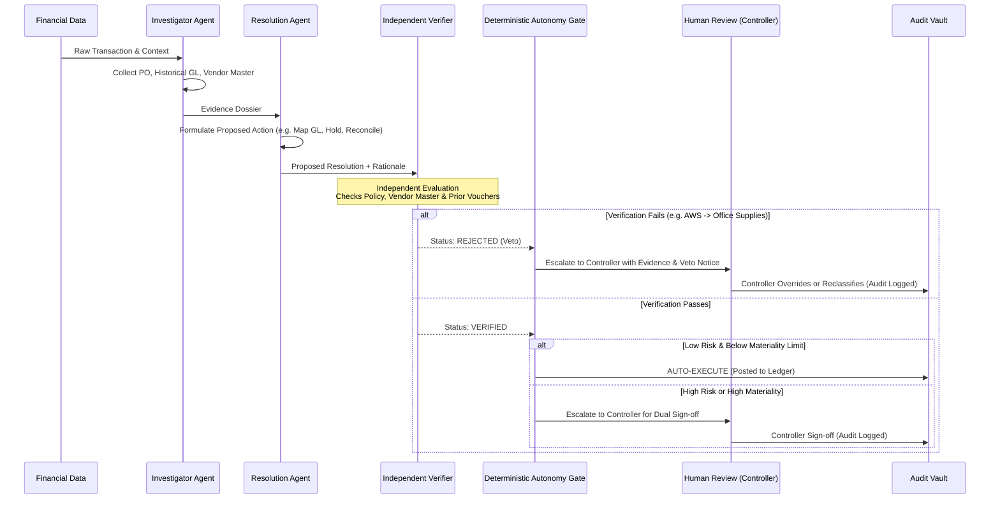

# Independent Verification & Autonomy Architecture

The core tenet of LedgerProof is: **Finance agents must never approve their own work.**

---

## 1. Dual-Agent Separation: Investigator, Resolution Agent & Independent Verifier



---

## 2. The Adversarial "Wow Moment": Preventing Misclassification

A live demonstration scenario showcases the critical need for independent verification:
1. **Input**: An invoice from **Amazon Web Services (AWS)** arrives for compute infrastructure (`₹103,000` / `$1,250`).
2. **Resolution Agent Error**: An initial heuristic proposes classifying the expense under GL Account `6400` (**Office Supplies & Stationery**).
3. **Independent Verifier Veto**:
   - The Independent Verifier intercepts the proposal.
   - It queries corporate policy `GL-MAPPING-04` and the Vendor Master.
   - It finds that vendor `Amazon Web Services Inc.` has an active master contract mapped strictly to GL Account `6100` (**Cloud Infrastructure**).
   - The Verifier outputs:
     ```json
     {
       "verifier_status": "REJECTED",
       "reason": "Proposed GL 6400 (Office Supplies) violates Master Vendor Mapping policy GL-MAPPING-04 for AWS. Mandated account is 6100 (Cloud Infrastructure).",
       "evidence": ["VENDOR-MASTER-AWS-001", "CONTRACT-AWS-2026-CLOUD"],
       "risk_tier": "TIER_C",
       "autonomy_action": "BLOCK_AUTO_EXECUTION"
     }
     ```
4. **Outcome**: The erroneous automated posting is blocked. The transaction is escalated to the Controller workspace with full explanatory evidence, protecting the company's financial books from corruption.

---

## 3. Autonomy Gate Decision Matrix

| Verification Status | Risk Tier | Materiality Amount | Action Type | Autonomy Gate Decision |
| :--- | :--- | :--- | :--- | :--- |
| `VERIFIED` | Low (`TIER_A`) | $< 5,000$ / $₹1,00,000$ | Standard Match | **Auto-Execute** (Instant Post) |
| `VERIFIED` | Medium (`TIER_B`) | $< 10,000$ / $₹5,00,000$ | Within Tolerance | **Auto-Execute** (With Alert) |
| `VERIFIED` | High (`TIER_C`) | $> 10,000$ / $₹10,00,000$ | Large Disbursement | **Human Review** (Dual CFO Sign-off) |
| `REJECTED` | Any | Any | Any | **BLOCKED** -> Mandatory Human Review |
| `INSUFFICIENT_EVIDENCE`| Any | Any | Any | **BLOCKED** -> Escalate for Documentation |
